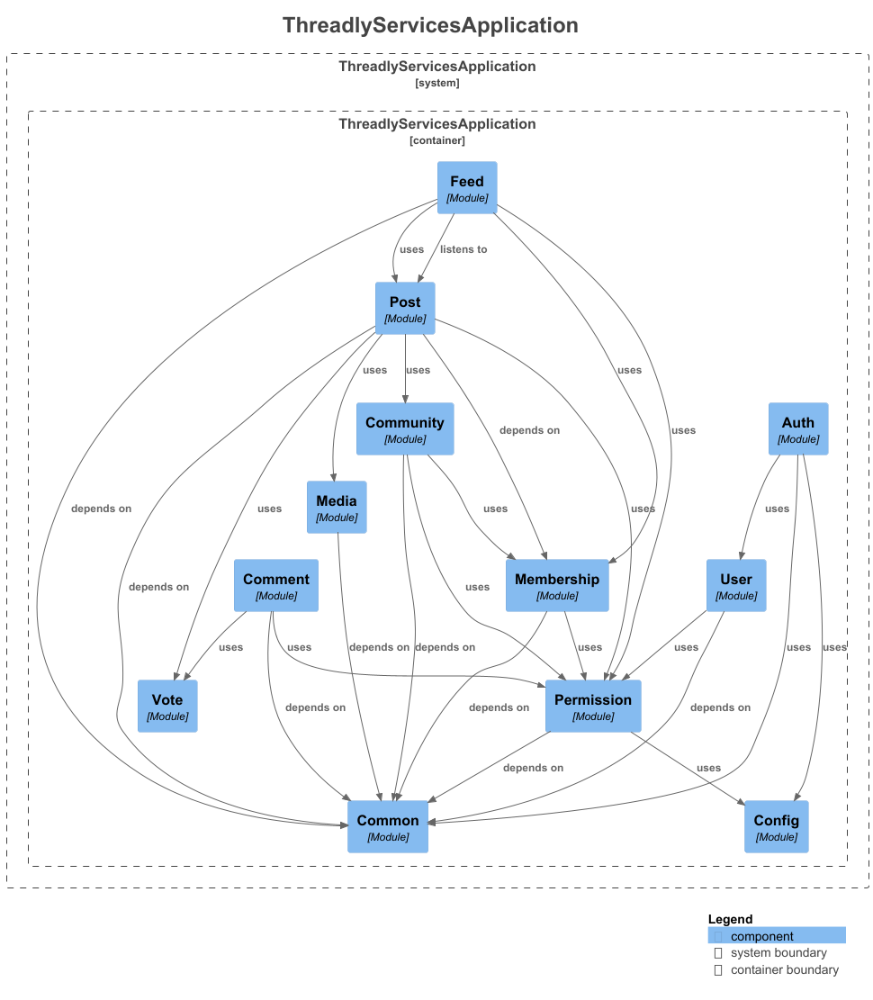

# Threadly

A full-stack, Reddit-like social platform built with a polyglot, event-driven microservice architecture — featuring community management, rich post creation, nested comments, voting, and fine-grained permission control.

---

## 📦 Monorepo Structure

| Directory                | Description                                                     |
| ------------------------ | --------------------------------------------------------------- |
| `threadly-spring-boot`   | Core REST API — Spring Boot 4, Spring Modulith, PostgreSQL      |
| `threadly-go`            | Background workers — image & SEO processing via RabbitMQ        |
| `threadly-ui`            | React 19 SPA — TanStack Router, TanStack Query, Tailwind CSS v4 |
| `threadly-observability` | Grafana dashboards for metrics and tracing                      |

---

## 🚀 Start Order

1. **Docker** — starts PostgreSQL, RabbitMQ, MinIO, SpiceDB (runs migrations)
2. **Go Worker** — initializes MinIO buckets
3. **Spring Boot** — runs SpiceDB schema migrations + Flyway DB migrations

```bash
# Start infrastructure
cd threadly-spring-boot && docker compose up -d

# Start Go workers
cd threadly-go && go run ./cmd/image-worker
cd threadly-go && go run ./cmd/seo-worker

# Start API
cd threadly-spring-boot && ./mvnw spring-boot:run

# Start UI
cd threadly-ui && npm install && npm run dev
```

---

## 🔧 Backend — Spring Boot (Java 21)

- **Modular REST API** using **Spring Boot 4** and **Spring Modulith**, with explicit boundaries across `auth`, `community`, `post`, `comment`, `vote`, `feed`, `media`, and `membership` domains
- **Relationship-based access control (ReBAC)** via **SpiceDB (AuthZed)** over gRPC, replacing an unscalable AOP-based `@Permission`/`PermissionResolver` approach; permissions modeled for community owners, moderators, and members in a `.zed` schema
- **Event-driven architecture** using **RabbitMQ** with Spring Modulith's AMQP externalization for decoupled inter-module communication (`PostCreatedEvent`, `UserSignedUpEvent`, `CommunityCreatedEvent`, etc.)
- **Dual authentication** — **JWT** (stateless access & refresh tokens) + **OAuth2 / OpenID Connect** (Google social login) via Spring Security
- **Media storage pipeline** using **MinIO** (S3-compatible) with OkHttp for secure object retrieval
- **Schema migration** with **Flyway** — 10+ versioned PostgreSQL migrations (users, communities, posts, comments, votes, memberships, invites, feed)
- **API documentation** via **SpringDoc OpenAPI** with Swagger UI + Actuator integration



### 🌱 Spring Boot Environment Variables

The application is configured using Spring Boot environment variables.  
All values can be overridden via system environment variables or `.env` files.

---

#### 🗄 Database Configuration

| Environment Variable | Default                                       | Description                    |
| -------------------- | --------------------------------------------- | ------------------------------ |
| `DB_URL`             | `jdbc:postgresql://localhost:5432/mydatabase` | PostgreSQL JDBC connection URL |
| `DB_USERNAME`        | `myuser`                                      | Database username              |
| `DB_PASSWORD`        | `secret`                                      | Database password              |

---

##### 🐇 RabbitMQ Configuration

| Environment Variable | Default     | Description       |
| -------------------- | ----------- | ----------------- |
| `RABBIT_HOST`        | `localhost` | RabbitMQ host     |
| `RABBIT_PORT`        | `5672`      | RabbitMQ port     |
| `RABBIT_USERNAME`    | `guest`     | RabbitMQ username |
| `RABBIT_PASSWORD`    | `guest`     | RabbitMQ password |

---

##### 🔐 Google OAuth2

| Environment Variable   | Required | Description                |
| ---------------------- | -------- | -------------------------- |
| `GOOGLE_CLIENT_ID`     | ✅ Yes   | Google OAuth client ID     |
| `GOOGLE_CLIENT_SECRET` | ✅ Yes   | Google OAuth client secret |

Scopes used:

- `openid`
- `profile`
- `email`

---

##### 🔑 JWT Security

| Environment Variable | Required | Description                        |
| -------------------- | -------- | ---------------------------------- |
| `JWT_SECRET`         | ✅ Yes   | Secret key used to sign JWT tokens |

Token durations (configured internally):

- Access Token: `86400000 ms` (24 hours)
- Refresh Token: `1209600000 ms` (14 days)

---

##### 🗂 Media Server

| Environment Variable | Default                 | Description             |
| -------------------- | ----------------------- | ----------------------- |
| `MEDIA_ENDPOINT`     | `http://localhost:9000` | Media server endpoint   |
| `MEDIA_ACCESS_KEY`   | ✅ Yes                  | Media server access key |
| `MEDIA_SECRET_KEY`   | ✅ Yes                  | Media server secret key |

---

## ⚙️ Workers — Go (Go 1.24)

- **Two async worker services** (`image-worker`, `seo-worker`) consuming from **RabbitMQ** queues to process post-link media and SEO metadata off the hot request path
- **Web scraping pipeline** using **Colly** + **goquery** for Open Graph metadata extraction and thumbnail image download
- Handles edge cases: HTTP redirect chains, async image resolution from raw HTML
- Persists processed media to **MinIO** via `minio-go` SDK; structured logging with **Uber Zap**

---

## 🖥️ Frontend — `threadly-ui`

- **Type-safe SPA** with **React 19**, **TypeScript**, **TanStack Router** (file-based routing), and **TanStack Query** for cache-aware server state
- **Rich text post editor** using **Tiptap** (ProseMirror-based) with link and placeholder extensions
- Full community, post, and comment flows — infinite-scroll feed, nested comment threads, upvote/downvote
- **Moderator tooling** — dedicated `/mod/:communityName` route group with invite management, approved users, and moderator roster; permission-aware UI rendering
- **User profile pages** — tabbed views for submitted posts, comments, upvoted, downvoted, and saved content
- Global state via **Jotai** atoms; URL-driven state with **nuqs**; UI components with **Radix UI** / **shadcn**
- Code quality enforced with **Biome** (lint + format) and **Vitest** for unit tests

---

## 📊 Observability

- **Prometheus** metrics via Micrometer + Spring Boot Actuator
- **Spring Modulith Observability** for module-level tracing
- Structured logs with embedded `traceId` / `spanId` for distributed trace correlation
- **Grafana** dashboards provisioned via `threadly-observability`

---

## 🏗️ Infrastructure (Docker Compose)

| Service            | Image                                | Purpose                   |
| ------------------ | ------------------------------------ | ------------------------- |
| PostgreSQL         | `postgres:16`                        | Primary database          |
| RabbitMQ           | `rabbitmq:4-management`              | Message broker            |
| MinIO              | `minio/minio`                        | Object/media storage      |
| SpiceDB            | `authzed/spicedb:v1.31.0`            | ReBAC permission engine   |
| SpiceDB Migrate    | `authzed/spicedb:v1.31.0`            | One-shot schema migration |
| SpiceDB Playground | `ghcr.io/authzed/spicedb-playground` | Dev permission debugger   |

---

## 🔑 Known Challenges Solved

| Problem                               | Solution                                                |
| ------------------------------------- | ------------------------------------------------------- |
| Scalable permissions                  | Replaced AOP `@Permission` with SpiceDB ReBAC over gRPC |
| Heavy I/O on request path             | Async Go workers via RabbitMQ for image/SEO processing  |
| Redirect chains during image download | Custom redirect-following OkHttp/Go HTTP client logic   |
| HTML content storage & rendering      | Tiptap editor with ProseMirror, stored as HTML          |
| Infinite pagination                   | Cursor-based feed table with keyset pagination          |
| Secure media access                   | Presigned MinIO URLs via object bucket key abstraction  |

---

## ⚠️ Planned Improvements

- Introduce **Redis + BullMQ** to buffer synchronous DB writes asynchronously, addressing the current throughput bottleneck on high-traffic endpoints
