# Screenshots

A visual walkthrough of Threadly's core user flows.

---

## Authentication

### Sign Up
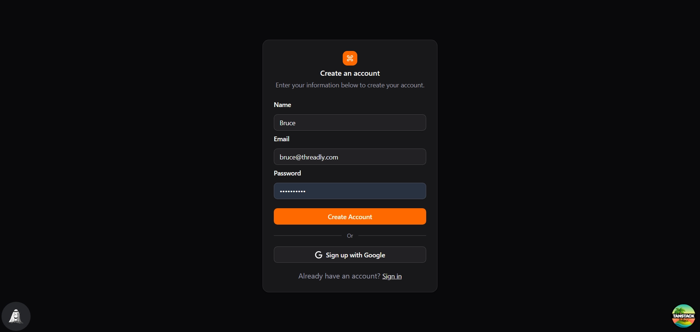

---

## Community

### Community Home
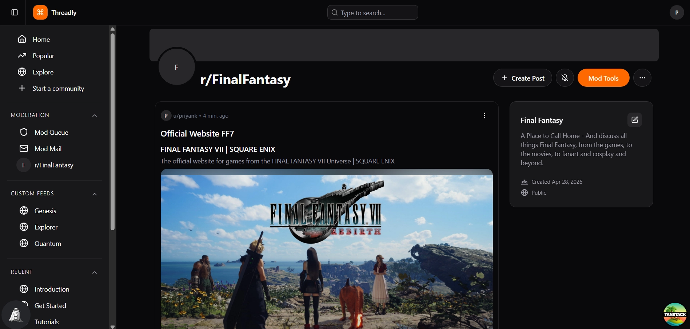

### Edit Community
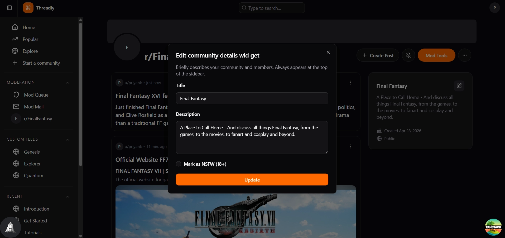

---

## Moderation

### Invite Moderator
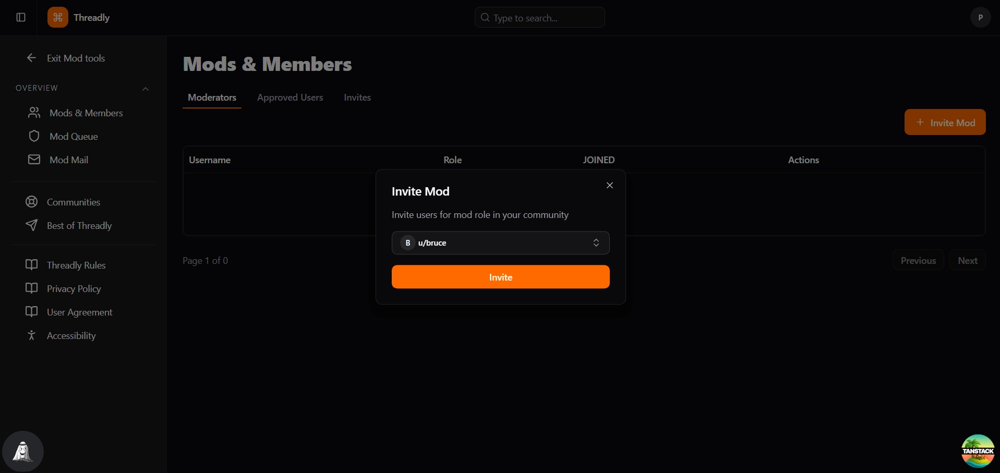

### Invite Sent
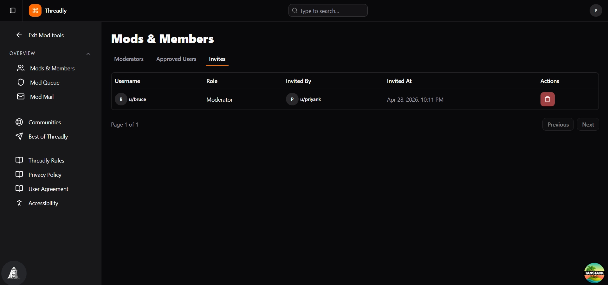

### User Receives Mod Invite
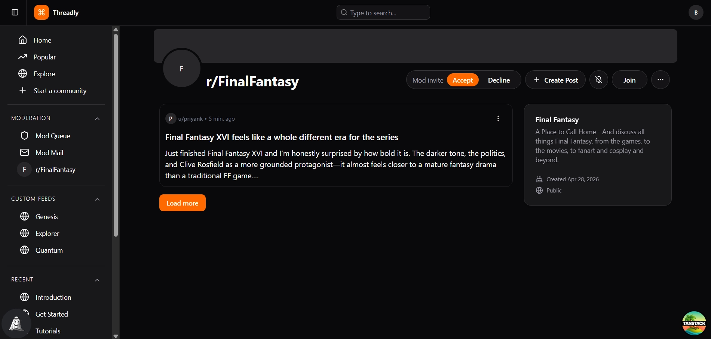

---

## Posts

### Create Text Post
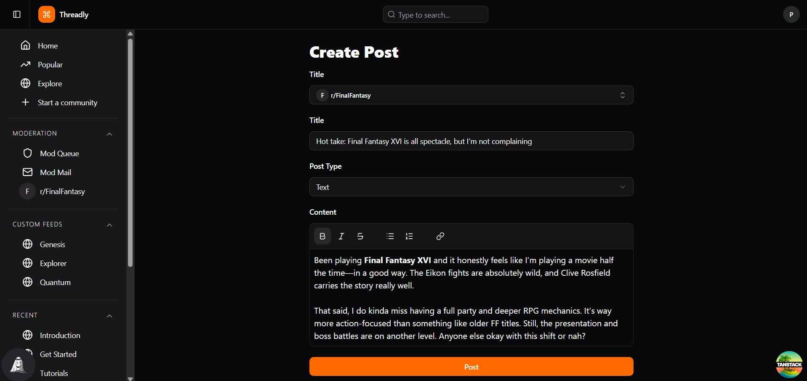

### Create Link Post
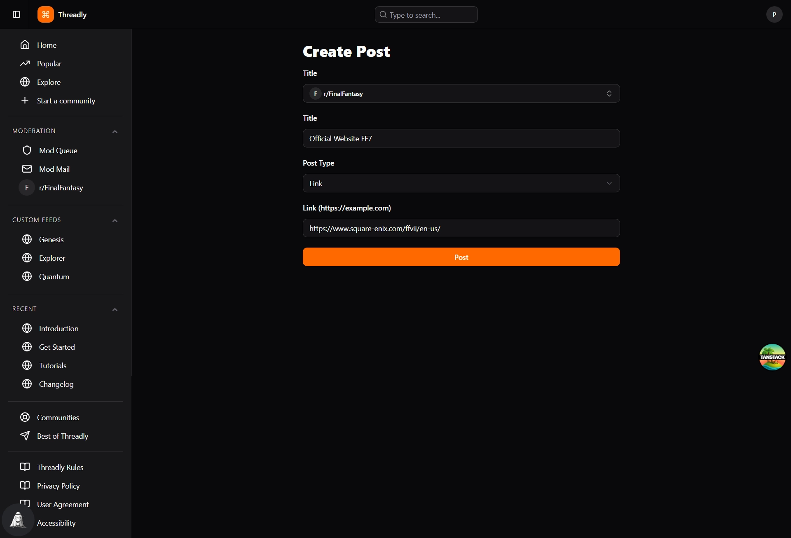

### Link Post View
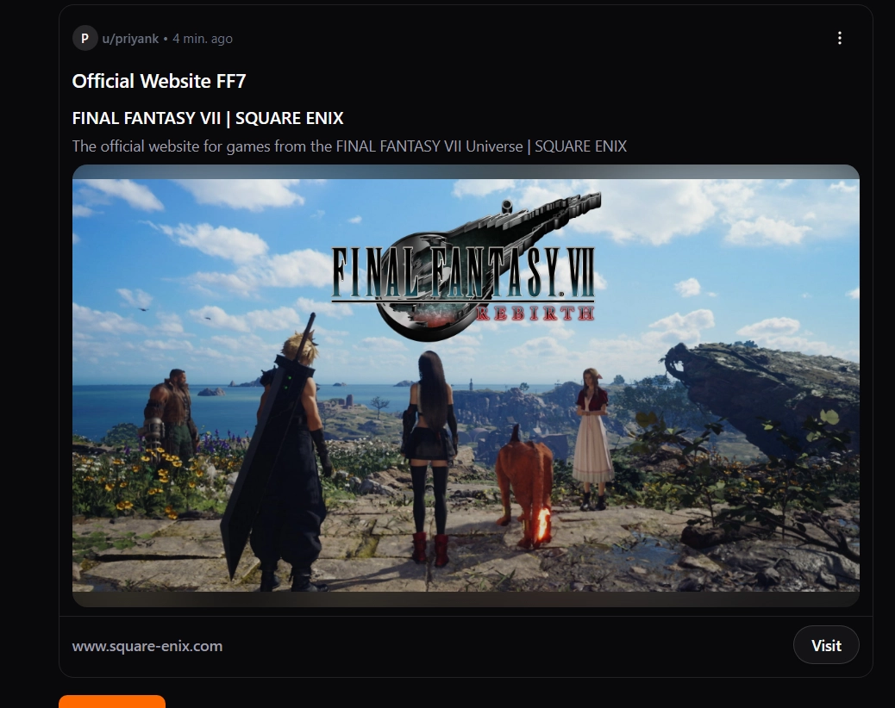

### Load More Posts
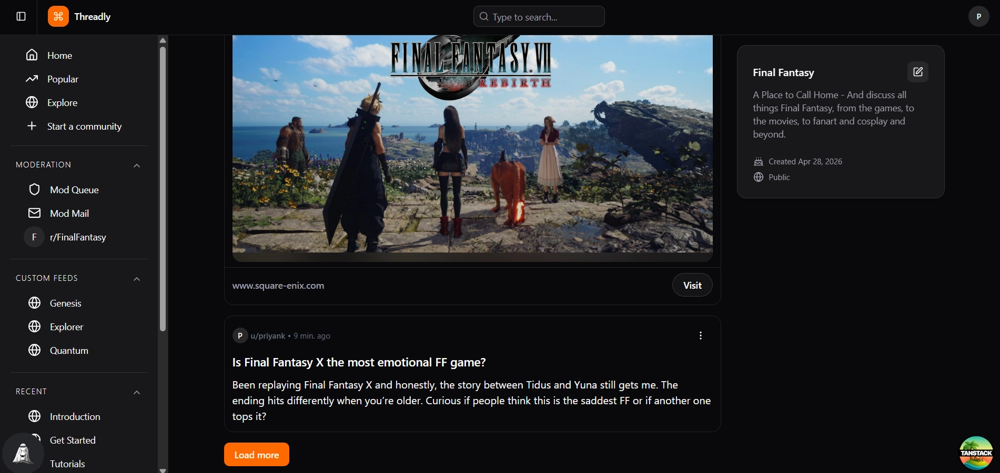

### Post With No Comments
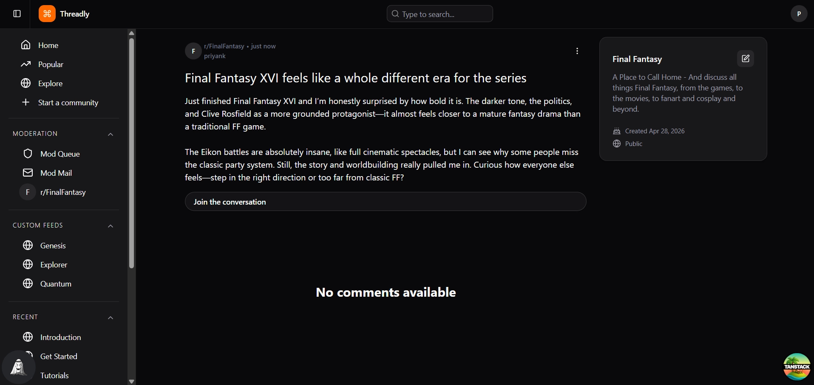

---

## Comments

### Add a Comment
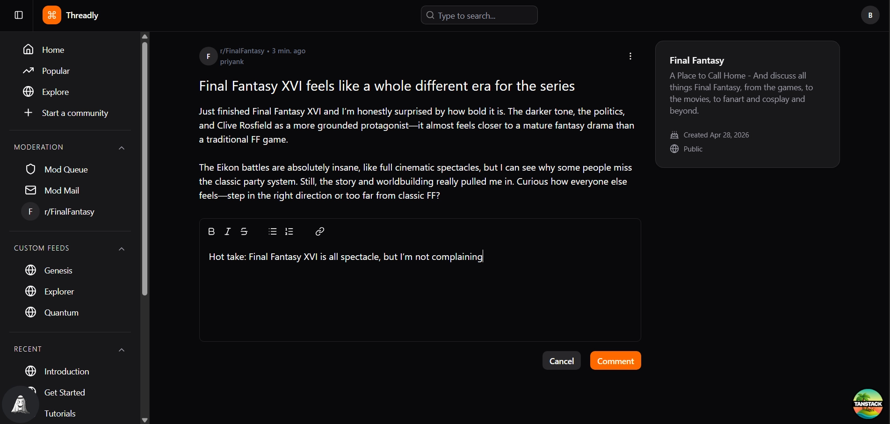

### Comment Thread
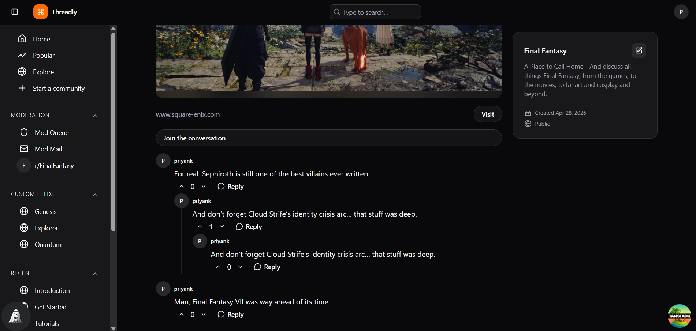

---

## User Profile

### User Page
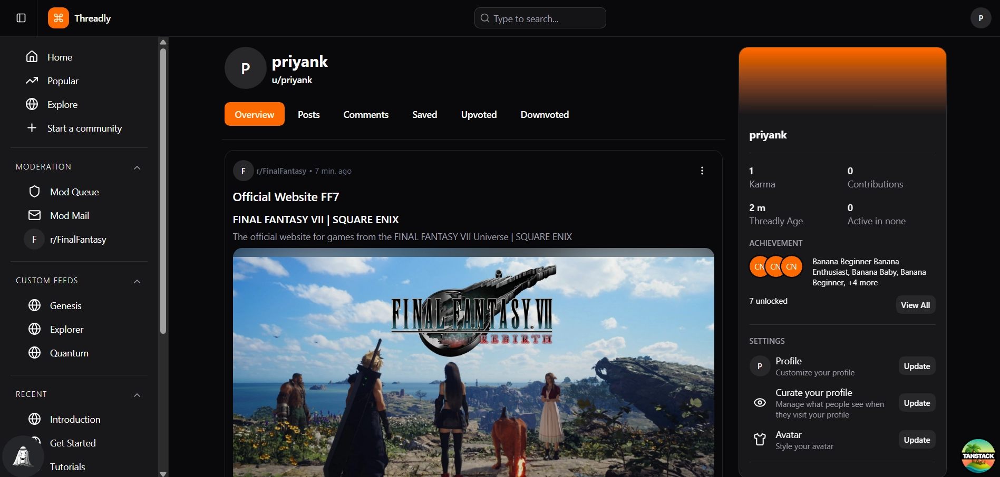

---

## API

### Spring Boot Swagger UI
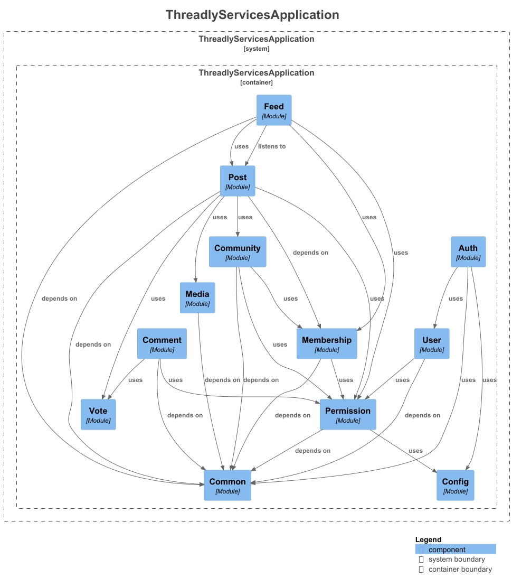
